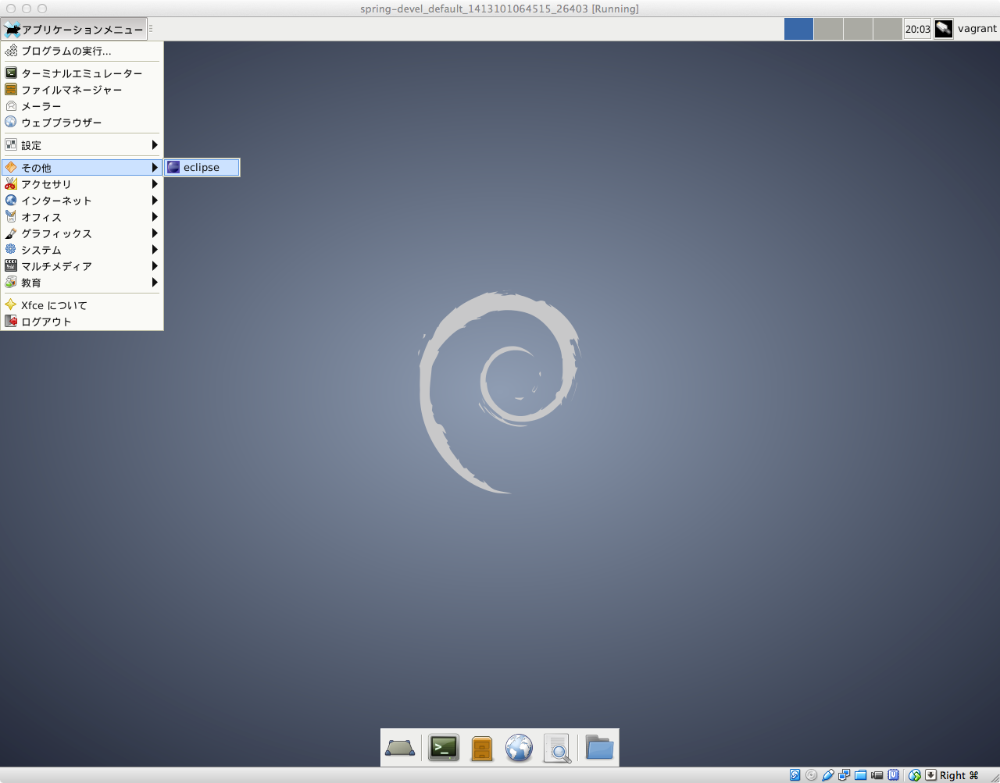
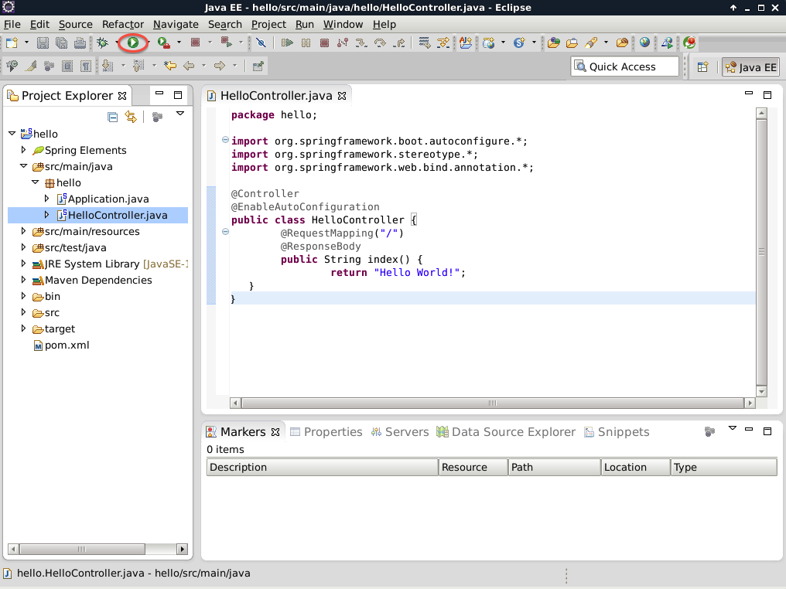
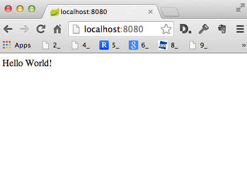
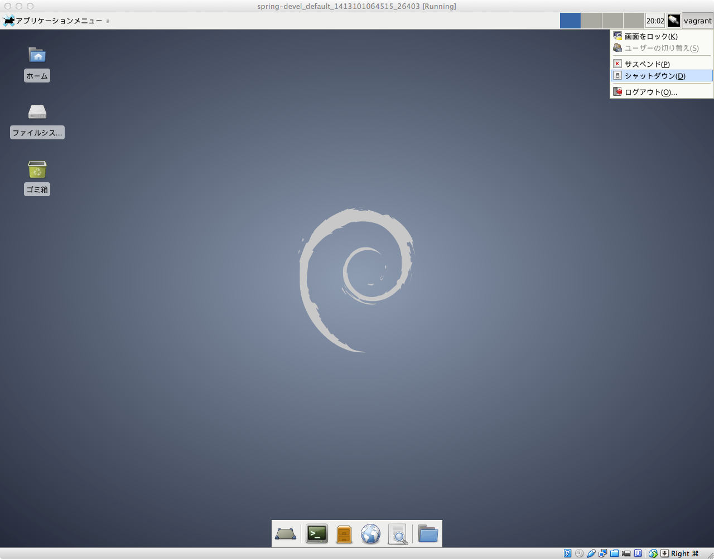
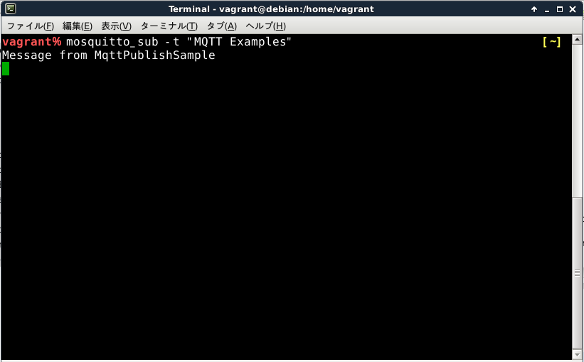

# Spring Framework Javaアプリケーション開発環境のセットアップ

## はじめに

- このドキュメントは，[Spring Framework](http://spring.io/projects)を使用してJava Applicationを開発するためのLinux環境を構築する手順を示したものである．
- 本レポジトリに含まれている`Vagrantfile`を使用して仮想Linuxマシンを半自動的に構築し，Java Applicationの開発環境を整備する．

## 環境構築

- まずは仮想マシン上に開発環境を構築する．
- 構築手順の概要は以下の通りである．
	1. VagrantとVirtualBoxの導入
	1. Vagrant omnibus pluginの導入
	1. レポジトリのclone
	1. 仮想マシンの起動と設定

### VagrantとVirtualBoxの導入
- Vagrantは仮想マシンを半自動的に作成するツールである．
- 以下から取得し，手順に従ってインストールしておく．
	- <http://www.vagrantup.com/>

- VirtualBoxはx86仮想化ソフトウェアである．
- 以下から取得し，手順に従ってインストールしておく．
	- <https://www.virtualbox.org/>
	- 執筆時点の最新版（4.3.18）でも修正されていないバグによりeclipseが起動しなくなるため，ver 4.3.6をインストールする．
		- OpenGL周りのバグ[#12746](https://www.virtualbox.org/ticket/12746)，[#12941](https://www.virtualbox.org/ticket/12941)．

### Vagrant pluginの導入

- Macユーザは「ターミナル.app」を，Windowsユーザは「コマンドプロンプト」を開き，以下のコマンドを実行する．
	- 「ターミナル.app」はSpotlightに`Terminal`と入力すれば起動できる．
	- 「コマンドプロンプト」は`Windows+R`を押して`cmd`と入力すれば起動できる．

```
$ vagrant plugin install vagrant-omnibus
$ vagrant plugin install vagrant-proxyconf
```

- OSXでエラーが出る場合には先頭に`NOKOGIRI_USE_SYSTEM_LIBRARIES=1 `を付けて試してみる．


### レポジトリのclone
- Windowsユーザは`git`をインストールしておく．
- gitを使って以下のレポジトリをcloneし，submoduleを入手する．

```
$ git clone https://github.com/pman0214/spring-devel.git
$ git submodule init
$ git submodule update
```

### 仮想マシンの起動と設定
- 先ほどcloneしたディレクトリに入る．

```
$ cd spring-devel.git
```

- Javaのインストールには許諾に同意する必要があるので，`Vagrantfile`を編集し，`accept_oracle_download_terms`の値を`false`から`true`に書き換える．
- 仮想マシンを起動する．
	- 時間はかかるが，以下のコマンドを入力すれば仮想マシンが起動して各種アプリケーションが自動的にインストールされる．

```
vagrant up
```

- アプリケーションのダウンロード先が混雑している場合など，上記コマンドがエラー終了する場合がある．その場合には以下のコマンドをエラー無く終了するまで繰り返し実行する．

```
$ vagrant provision
```

- エラー無く終了したら，以下のコマンドで仮想マシンを停止する．

```
$ vagrant halt
```

## サンプルプロジェクトの作成

- サンプルとして，「Hello World!」を表示するWebアプリケーションを作成する．
- eclipse上の操作によりSpring Framework ProjectのWebページからテンプレートとなるプロジェクトを自動的にダウンロード・設定することができる．

- まず，Vagrantfileを編集して仮想マシン起動時にGUIを表示させるようにする．

```
vb.gui = false
     ↓
vb.gui = true
```

- 仮想マシンを起動してログインする
	- ログインユーザ名・パスワードは両方とも`vagrant`である．

```
$ vagrant up
```

- 仮想マシンが起動したら，eclipseを起動する．



- 次に，`Project Explorer`で右クリックし，`New` → `Project...`とたどる．

")

- `Spring`を展開して`Spring Starter Project`を選択し，`Next`をクリックする．

")

- プロジェクトの情報を入力する．このとき，`Style`の部分では`Web`を選択しておく．

")

- 最後のページは何も変更せずに`Finish`をクリックする．
	- この操作後にしばらく待つことで`Project Explorer`に`hello`というプロジェクトが作成される．

")

- `hello`プロジェクトを編集し，`Hello World!`を表示するコードを記述する．具体的には，以下の手順で`Controller`と呼ばれるクラスを新しく作成し，そこにコードを記述する．
- `hello`プロジェクトを開き，`src/main/java`を開く．
- その中の`hello`を右クリックし，`New` → `Class`とたどる．

")

- `Name`に`HelloController`と入力して`Finish`をクリックする．

")

- `HelloController.java`が作成されるので，ここに以下のようなコードを記述する．

```java
package hello;

import org.springframework.boot.autoconfigure.*;
import org.springframework.stereotype.*;
import org.springframework.web.bind.annotation.*;

@Controller
@EnableAutoConfiguration
public class HelloController {
	@RequestMapping("/")
	@ResponseBody
	public String index() {
		return "Hello World!";
	}
}
```

- これで`Hello World!`表示Webアプリは完成した．
- Eclipseの上部にあるプログラムの実行ボタン（緑の四角の中に再生マークが書いてあるボタン）を押してプログラムを実行する．



- 動作の確認は仮想マシンではなく，ホスト側（自分が使っているMac，Windows）のWebブラウザで行う．
- Webブラウザで<http://localhost:8080>にアクセスすると「Hello World!」というページが表示される．



- プログラムを停止する場合，停止ボタン（実行時にクリックしたボタンの近くにある赤い四角いボタン）をクリックする．
- 仮想マシンを使用し終わったら，シャットダウンしておく．



- 再び仮想マシンを起動する際は，以下のコマンドを実行すれば良い．

```
$ vagrant up
```

## MQTTクライアントライブラリの導入

### 概要

- [MQTTプロトコル](http://www.ibm.com/developerworks/jp/websphere/library/wmq/mqtt31_spec/)は，センサとモータなどのアクチュエータとの連携をするために設計された通信プロトコルである．
- `Broker`と呼ばれるMQTTサーバに対して複数のクライアントを`Subscribe`（登録）しておく．
- `Broker`に`Publish`メッセージが到着すると，`Subscribe`している全てのクライアントに対して`Publish`のメッセージ内容が通知される．
- `Subscribe`，`Publish`は`Topic`と呼ばれる識別子を使って区別される．

### JavaプログラムへのMQTTクライアントライブラリの導入

- Spring Frameworkを用いたJavaアプリケーションからMQTTサーバに接続するためにはMQTTクライアントライブラリが必要となる．
- Spring FrameworkはMavenと呼ばれる構築ツールを用いているため，この設定ファイルの中にMQTTクライアントライブラリの情報を記載するだけで良い．
- ここではサンプルプロジェクトを例に説明する．

- サンプルプロジェクトの一番上の階層にある`pom.xml`を開き，下部にある`pom.xml`タブを開く．

")

- `<modelVersion>`の行の下に以下のコードを追加する．

```xml
 <repositories>
  <repository>
   <id>Eclipse Paho Repo</id>
   <url>https://repo.eclipse.org/content/repositories/paho-releases/</url>
  </repository>
 </repositories>
```

- 次に，`Dependencies`タブを開いて`Add...`ボタンをクリックする．

")

- `Dependency Properties`ダイアログにおいて，それぞれ以下の設定を行う．

")

- 入力したら`OK`をクリックし，`pom.xml`を保存する．


## MQTTサンプルプログラムの作成

- PahoのJavaサンプルを流用し，MQTT BrokerにPublishするコントローラを作成する．
	- [Paho](http://www.eclipse.org/paho/clients/java/)
- `HelloController`のときと同様にして`MqttController`を作成する．
- `MqttController.java`に以下を記述する．

```java
package hello;

import org.springframework.boot.autoconfigure.*;
import org.springframework.stereotype.*;
import org.springframework.web.bind.annotation.*;
import org.eclipse.paho.client.mqttv3.MqttClient;
import org.eclipse.paho.client.mqttv3.MqttConnectOptions;
import org.eclipse.paho.client.mqttv3.MqttException;
import org.eclipse.paho.client.mqttv3.MqttMessage;
import org.eclipse.paho.client.mqttv3.persist.MemoryPersistence;

@Controller
@EnableAutoConfiguration
public class MqttController {
	@RequestMapping("/mqtt")
	@ResponseBody
	public String index() {
		String topic = "MQTT Examples";
		String content = "Message from MqttPublishSample";
		int qos = 2;
		String broker = "tcp://localhost:1883";
		String clientId = "JavaSample";
		MemoryPersistence persistence = new MemoryPersistence();

		try {
			MqttClient sampleClient = new MqttClient(broker, clientId,
					persistence);
			MqttConnectOptions connOpts = new MqttConnectOptions();
			connOpts.setCleanSession(true);
			System.out.println("Connecting to broker: " + broker);
			sampleClient.connect(connOpts);
			System.out.println("Connected");
			System.out.println("Publishing message: " + content);
			MqttMessage message = new MqttMessage(content.getBytes());
			message.setQos(qos);
			sampleClient.publish(topic, message);
			sampleClient.disconnect();
			return ("Message published");
		} catch (MqttException me) {
			String error_msg;
			error_msg = "reason " + me.getReasonCode() + "\n";
			error_msg += "msg " + me.getMessage() + "\n";
			error_msg += "loc " + me.getLocalizedMessage() + "\n";
			error_msg += "cause " + me.getCause() + "\n";
			error_msg += "excep " + me + "\n";
			error_msg += me.getStackTrace();
			return (error_msg);
		}
	}
}
```

- このプログラムは，ホスト側のブラウザで<http://localhost:8080/mqtt>にアクセスしたときにMQTT Brokerに対してメッセージをPublishするものである．
	- Publishに成功すれば`Message Published`と表示され，失敗したときはエラーが表示される．
- MQTT Brokerへのメッセージを確認するためにはMQTT BrokerにSubscribeするプログラムが必要となる．ここでは`mosquitto_sub`コマンドを用いる．
- `アプリケーションメニュー`から`ターミナルエミュレータ`を開いて，以下のコマンドを実行する．

```
$ mosquitto_sub -t "MQTT Examples"
```

- このコマンドを実行することで`MQTT Examples`というTopicのメッセージ通知を受け取ることができる．
- Hello Worldアプリのときと同様にJavaプログラムを実行し，ホスト側ブラウザから<http://localhost:8080/mqtt>にアクセスすると，ブラウザ，ターミナルエミュレータ上にはそれぞれ以下のように表示される．
	- ブラウザ	- `Message published`
	- ターミナルエミュレータ - `Message from MqttPublishSample`



- Javaプログラム，`mosquitto_sub`を停止する．
	- ターミナルエミュレータの`mosquitto_sub`コマンドの停止は`Ctrl+C`である．